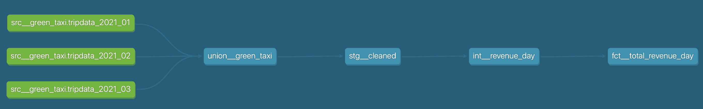
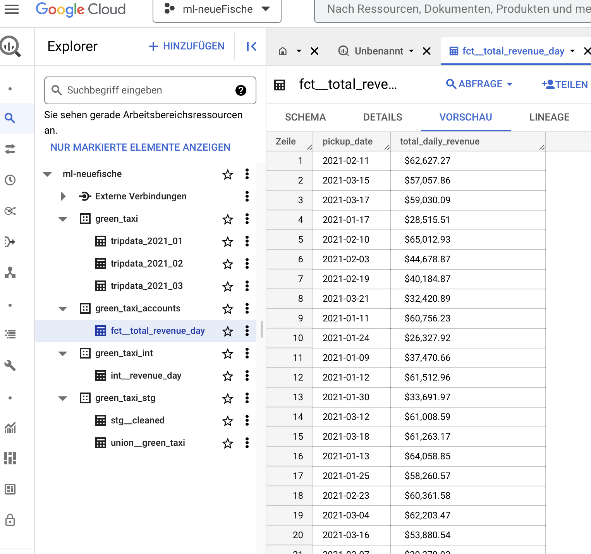

# Data Pipeline Project

In this project, as part of the neue Fische ML Engineering bootcamp, I built a data pipeline that is processing the `Green Taxi Trips` of the NYC Taxi Trip Dataset. The project objective was to:

1. Write a script that is directly uploading the data of the first 3 months of the year 2021 to a Google Cloud Storage bucket.

2. Write an ELT pipeline, to extract data from the GCS bucket and produce a table showing revenue per day, preferably automated with a workflow orchestration. 

# Results 

Here is the dbt lineage graph produced in the transformation step:

Here are the final results produced on GCP Big Query:

## Project reflection
1. What are the steps I took to complete the project?
    * [Data ingestion script](src/data_ingestion.py) to upload taxi data from external cloud to GCP cloud storage bucket as .parquet, partitioned into monthly files. I used a GCP server client and JSON keyfile to establish a connection. The Bucket and a User Profile with Storage Admin priviledges had to be added first
    * [Extract and load](src/extract_load.py) functions to extract parquet data from GCP storage bucket into pandas dataframe, month by month, and load to GCP BigQuery. I added a BigQuery project and dataset, and a separate keyfile to simulated the separation of priviledges between Storage and BigQuery Administrators. I chose to complete these steps locally (without local storage) so that the workflow could be more easily orchestrated with Prefect later. I chose to keep the files in monthly partitions to make the working memory overhead smaller for the EL steps.
    * [Transformation with dbt](./transform_bq/):
        * Initialise a dbt project with connection to  BigQuery by setting up the profile
        * [Union](./transform_bq/models/staging/union/union__green_taxi.sql) of all monthly tables into one table
        * [Staging](./transform_bq/models/staging/stg__cleaned.sql) the table with with addition of pickup date column and small cleaning step to remove erroneous dates 
        * [Intermediate](./transform_bq/models/intermediate/int__revenue_day.sql) calculation of total revenue per day
        * [Mart](./transform_bq/models/mart/accounts/fct__total_revenue_day.sql) changing the display format to accounting ($100,000.00) and serving into a designated mart for the accountant role, to ensure data goverance later

2. What are the challenges I faced?
    * **Accessing the BigQuery database** was more diifficult that I expected. I had chosen the location "EU" (from the options US or EU) for the connection during dbt init, yet only an empty table was created in this location before throwing an error. For some reason, dbt could not find my dataset on the europe-west3 server after this, even after explicitly setting the location to "europa-west3". Only after the empty table was deleted and the exact server location was specified did dbt run.
    * Writing the **jinja script** for the union was not easy because the similarity to python is not as much as I would have expected. Jinja is worth spending more time with to make the dbt scripts more flexible.
    * I wanted to cast the final output of revenue per day as a Decimal(), but **parameterized types** are not available in BigQuery. It worked as a string though (and looks a lot nicer with a dollar sign).

3. What I will do differently when I have more time
    * I really want to use prefect to **orchestrate the workflow**
    * I want to make the number of **monthly files** that are extracted, loaded and transformed into an **arbitrary parameter**, so that the user can decide which months are loaded/updated. This will mean making the src.yml file able to take dynamic inputs for the table names. I am not sure if this is possible, but I would like to try.